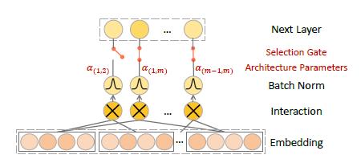
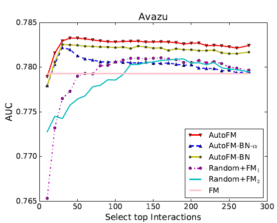

# AutoFis

## 1. 算法介绍

AutoFis是推荐场景的自动特征选择算法。推荐场景的神经网络预测模型（包括但不限于CTR预测）可简单分为三个模块：Embedding Layer，Interaction Layer以及MLP Layer，其中Interaction Layer是整个预测模型的关键模块，它需要有效的对特征交互建模。现有预测模型主要基于FM(Factorization Machines)对特征交互建模，在二阶的情况下，即为所有二阶特征交互建模，总数目为O(N^2)。实际情况中，并非所有特征交互都是有效的，可能夹杂噪音，有损模型预测的精度。AutoFis可以从O(N^2)特征空间中自动学习出有效的那部分特征交互，通过门限函数屏蔽冗余的部分，从而提升预测模型的精度。AutoFis适用的模型有FM，FFM，DeepFM等。  


## 2. 算法原理

AutoFis主要由两个阶段构成。第一阶段（search），通过搜索自动学习得到每个特征交互的重要性得分；第二阶段（retrain），在第一阶段的基础上，将不重要的特征交互屏蔽，并重新训练模型，以达到更优效果。  


### 2.1 搜索空间

在搜索空间上，对于二阶交互，AutoFis的搜索空间为整个二阶交互的全空间N*(N-1)/2，通过结构参数`alpha`来学习每一个二阶交互特征的权重。模型训练至最终收敛后得到的`alpha`即代表对应的各个特征交互的重要性。

### 2.2 搜索策略

搜索策略上，代表特征交互重要程度的结构参数`alpha`在模型训练过程通过one-level optimization方式进行搜索。
search阶段，利用优化器GRDA [1] 对结构参数`alpha`进行优化，并学习到一个稀疏解，稀疏解可以drop掉多数无用的特征交互，最后只留下有益的特征交互。
retrain阶段，AutoFis基于search阶段模型训练得到的结构参数`alpha`，根据`alpha`逐步将不重要的特征交互进行屏蔽并重新训练，进一步提高模型的精度。

## 3. 使用指导

### 3.1 运行环境设置

在配置文件中进行参数配置，该文件位于automl/examples/nas/fis/autogate_grda.yml。其由以下几个主要部分组成：

```yaml
general:
    worker:                                    # worker
        devices_per_job: -1                    # worker所需的gpu数目 (default: -1)

pipeline: [search, retrain]                    # AutoFis两个阶段的pipeline

search:                                        # AutoFis的search阶段
    pipe_step：                                # pipe_step类型
    dataset：                                  # 数据集的配置
    model：                                    # 模型参数和结构的配置
    trainer：                                  # 训练优化器的配置
    evaluator：                                # 评估的配置
retrain:                                       # AutoFis的retrain阶段

```

### 3.2 数据集设置

AutoFis使用的数据是通用的CTR预测数据集格式，采用稀疏矩阵表示方式，存储为`.npy`文件。例如, 特征向量`x = [0,0,0,1,0.5,0,0,0,0,0]`可以通过这两个向量表示 `feature_id = [3, 4], feature_val = [1, 0.5]`, 第一个向量表示非零特征的id，第二个向量表示这些特征对应的取值。很多场景下`x`是二值向量，此时`feature_val`是全为1的向量，可以省略。

此处以公开数据集Avazu为例，介绍如何配置：

```yaml
dataset:
    type: AvazuDataset                         # 数据集
    batch_size: 2000                           # batch size大小
    common:
        data_path: s3://bucket-sc-yujinkai/Avazu/ # 数据集的数据路径

```

### 3.3 模型设置

AutoFis可以用于对FM，FFM，DeepFM等模型的特征交互进行选择，此处以DeepFM为例，介绍如何配置：

```yaml
model:
    model_desc:
        modules: ["custom"]
            custom:
                input_dim: 645195              # 整个训练集的特征数目，即`x`向量的维度。
                input_dim4lookup: 24           # 单个样本中非零特征的个数，即`feature_id`向量的维度
                embed_dim: 40
                hidden_dims: [700, 700, 700, 700, 700]
                dropout_prob: 0.0
                batch_norm: False
                layer_norm: True
                alpha_init_mean: 0.0
                alpha_activation: 'tanh'
                selected_pairs: []             # 默认为空，即保留所有特征交互
                name: AutoGateModel            # 模型名称

```

### 3.4 优化器设置

AutoFis的search阶段需要配置Adam和GRDA两个优化器，下面介绍如何配置：

```yaml
trainer:
    type: Trainer
        callbacks: AutoGateGrdaS1TrainerCallback    # 配置search阶段的trainer callback
        epochs: 1                                   # epoch次数
        optim:
            type: Adam
            lr: 0.001
        struc_optim:                                # GRDA优化器参数
            struct_lr: 1                            # GRDA优化器学习率
        net_optim:                                  # Adam优化器参数
            net_lr: 1e-3                            # Adam优化器学习率
        c: 0.0005                                   # GRDA优化器参数initial sparse control constant
        mu: 0.8                                     # GRDA优化器参数sparsity control
        lr_scheduler:                               # 学习率scheduler
            type: StepLR
            step_size: 1000
            gamma: 0.75
        metric:                                     # 评估指标AUC
            type: auc
        loss:                                       # loss function BCEWithLogitsLoss
            type: BCEWithLogitsLoss
```

### 3.5 top-K AutoFis

AutoFis的特征交互选择是通过GRDA优化器来进行稀疏选择，此外，还可以通过取top K个最优的特征交互来直接选择，对应的样例可以参考：automl/examples/nas/fis/autogate.yml

与GRDA版本的AutoFis不同，top K版本的AutoFis只需要Adam一个优化器，因此训练较为便捷，模型的参数fis_ratio用于选择top比例的特征交互。 

### 3.6 算法输出

AutoFis 算法会输出模型的best performance， 以及对应的模型文件，包括 checkpoint和 pickle文件。
